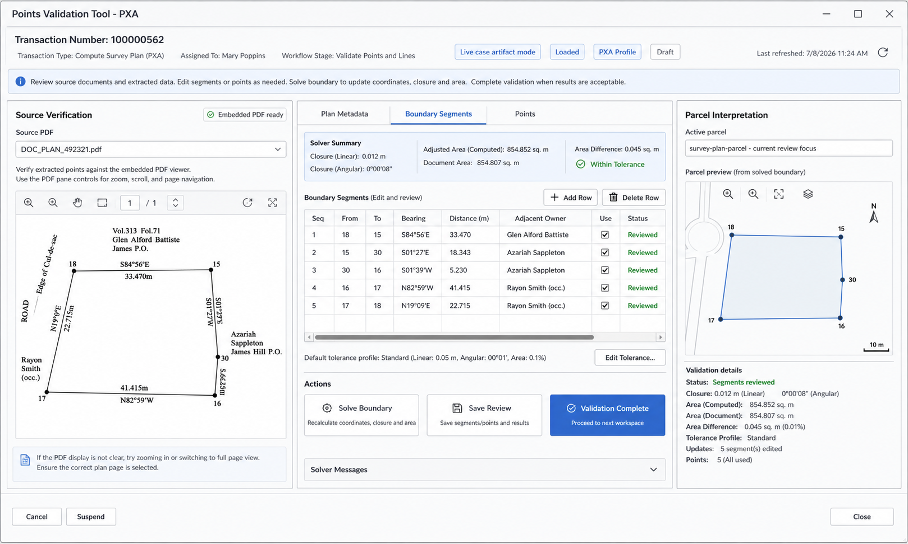

# Story 2.20: Add PXA Survey Plan Metadata Review Model And UX

Status: review

## Story

As a cadastral examiner,  
I want PXA survey-plan metadata, reviewed boundary segments, derived points, and parcel preview to be organized in a PXA-specific review workspace,  
so that scanned single-parcel survey plans can be reviewed from the PDF source, corrected deterministically, and carried forward with reportable metadata.

## Business Context

Story 2.18 introduced PXA survey-plan PDF extraction, and Story 2.19 added segment review plus deterministic boundary solving. The current PXA review surface now has the right ingredients, but the user workflow needs clearer hierarchy:

- The scanned survey plan PDF is the primary source.
- Printed/reference points should anchor the parcel in real coordinates.
- Reviewed boundary segments should drive derived point coordinates and parcel preview.
- Metadata from the survey plan must be captured and reviewed, not hidden in raw OCR output.
- PXA should not overload the PE point-review layout with unrelated metadata and segment controls.

For PXA, the examiner needs one review workspace that keeps the PDF visible while separating metadata review, segment correction, point coordinates, and parcel preview.

## UX Reference



The wireframe shows the intended PXA-only workspace pattern:

- Left: source PDF verification and embedded plan viewer.
- Center: tabbed review workspace.
- Right: active parcel interpretation, preview, and validation findings.

## Acceptance Criteria

1. Given a transaction resolves to the PXA workflow profile, when the Points Validation Tool opens, then the center review area uses PXA-specific tabs: `Plan Metadata`, `Boundary Segments`, and `Points`.

2. Given a transaction is not PXA, when the Points Validation Tool opens, then existing PE point-review behavior remains unchanged.

3. Given the `Plan Metadata` tab is selected, then the workspace displays editable/reviewable fields for:
   - coordinate system / `JAD 2001` present
   - north arrow present
   - parish
   - document area value and unit
   - survey date
   - survey instrument
   - surveyed by / surveyor
   - parties / owners / representatives
   - adjacent owners
   - volume and folio values

4. Given metadata values are extracted from OCR/vision, when the metadata form is shown, then each field preserves value, raw/source text where available, confidence/status where available, and examiner review state.

5. Given adjacent owners are reviewed, then the UI supports associating an adjacent owner with a boundary segment where possible.

6. Given the `Boundary Segments` tab is selected, then the workspace displays reviewed segment rows with editable sequence, from point, to point, bearing, distance, adjacent owner, include/use flag, status, and notes.

7. Given the user edits segment values and selects `Save Review`, then the save action persists reviewed segment values, runs the deterministic boundary solver, updates/derives point coordinates, recomputes closure/area diagnostics, refreshes parcel preview, and writes the updated artifact to `extraction_review_data.json`.

8. Given a reviewed segment chain is valid, when save/solve completes, then the parcel preview redraws from the reviewed segment chain rather than stale point order.

9. Given a reviewed segment chain is blocked, when save/solve completes, then the UI keeps validation incomplete and shows the exact blocker, including missing point references, duplicate point misuse, endpoint conflict, closure failure, or area mismatch.

10. Given derived points are created from reviewed segments, when the `Points` tab is selected, then derived rows appear with clear provenance/status and remain reviewable.

10a. Given the `Points` tab is selected, then printed/reference coordinate points are visually distinguishable from solver-derived points and unresolved candidate points.

11. Given metadata is reviewed and saved, then `extraction_review_data.json` contains a stable PXA metadata section suitable for downstream reports, Enterprise popups, and Innola spatial-unit context.

12. Given final reports are generated later, then PXA metadata and segment findings are available as reportable stage findings without reparsing the PDF.

13. Given automated tests run, then coverage proves PXA metadata persistence, segment-save solve/refresh behavior, adjacent-owner segment association, and non-PXA behavior preservation.

## Tasks / Subtasks

- [x] Add PXA metadata model and persistence. (AC: 3-5, 11-12)
  - [x] Add a typed survey-plan metadata model under the extraction review document.
  - [x] Preserve raw extracted values, reviewed values, confidence/status, source page/zone, and review notes.
  - [x] Save metadata into `extraction_review_data.json` under a stable section such as `survey_metadata`.
  - [x] Support adjacent-owner records with optional segment association.

- [x] Add PXA-specific review tabs. (AC: 1-6, 10)
  - [x] Add `Plan Metadata`, `Boundary Segments`, and `Points` tabs for PXA.
  - [x] Keep source PDF viewer visible beside the tabs.
  - [x] Keep parcel preview and validation findings visible in the right panel.
  - [x] Distinguish printed/reference anchor points, derived points, reviewed boundary segments, and solver conflicts in the PXA review surface.
  - [x] Ensure PE/non-PXA layout remains unchanged.

- [x] Wire segment save to solve and refresh. (AC: 7-10)
  - [x] On `Save Review`, persist segment edits before solving.
  - [x] Run the deterministic boundary solver after segment edits.
  - [x] Write derived/corrected point rows back into the artifact.
  - [x] Refresh the point table and parcel preview from the solved reviewed segment chain.
  - [x] Keep validation incomplete when solver status is blocked.

- [x] Expose metadata for downstream use. (AC: 11-12)
  - [x] Make metadata available to final report generation.
  - [x] Make reviewed PXA metadata available to Enterprise publish/popups where configured.
  - [x] Make relevant metadata available to Innola Spatial Unit creation when mapped.

- [x] Add tests. (AC: 1-13)
  - [x] Test metadata load/save round trip.
  - [x] Test adjacent owner to segment association.
  - [x] Test save action runs solver and updates derived points.
  - [x] Test parcel preview refresh uses reviewed segments.
  - [x] Test PE/non-PXA review UI remains unchanged.

### Review Findings

- [x] [Review][Patch] Plan Metadata tab omits party/representative and array volume-folio records — AC3 requires parties / owners / representatives and volume/folio values to be displayed and reviewable. The persistence layer loads `document.Parties` and `document.VolumeFolios`, but `LoadReviewDocumentIntoPane` only projects `SurveyMetadataFields` and `AdjacentOwners`, and the XAML only binds `VisibleMetadataFields` plus `VisibleAdjacentOwners`; array `volume_folio`, `parties`, and `representatives` are therefore not reviewable in the PXA tab. [`src/ParcelWorkflowAddIn/ParcelWorkflowAddIn/ParcelWorkflowDockpaneViewModel.cs:1419`]
- [x] [Review][Patch] PXA detection treats any segmented review artifact as PXA — AC2 says non-PXA review behavior must remain unchanged, but `IsPxaSurveyPlanDocument` returns true whenever `document.Segments.Count > 0`. Any PE/non-PXA artifact that gains segment rows will switch to the PXA tabbed UX. Detection should be based on the PXA profile/extractor/source metadata, not segment presence alone. [`src/ParcelWorkflowAddIn/ParcelWorkflowAddIn/ParcelWorkflowDockpaneViewModel.cs:1550`]

## Dev Notes

### Current State

Story 2.19 introduced reviewed segment persistence, the segment grid, and `SurveyPlanBoundarySolver`. The next gap is UX organization and metadata persistence.

The user expectation is:

```text
Reviewed segments guide the process.
Save segment edits -> solve boundary -> update points -> refresh preview.
```

Do not require the examiner to leave and reopen the workspace to see the corrected parcel preview.

### Metadata Shape Recommendation

Use a stable review-friendly artifact shape:

```json
{
  "survey_metadata": {
    "coordinate_system": {
      "value": "JAD 2001",
      "present": true,
      "confidence": 0.9,
      "source_page": 1,
      "source_zone": "title_block",
      "review_status": "accepted",
      "review_notes": null
    },
    "north_arrow": {
      "present": true,
      "confidence": 0.8,
      "source_page": 1,
      "source_zone": "plan_body",
      "review_status": "accepted"
    },
    "parish": {
      "value": "Clarendon",
      "review_status": "accepted"
    },
    "document_area": {
      "value": 854.807,
      "unit": "sq_m",
      "raw_text": "854.807 sq. metres",
      "review_status": "accepted"
    },
    "survey_date": {
      "value": "2024-09-03",
      "raw_text": "September 03, 2024",
      "review_status": "accepted"
    },
    "survey_instrument": {
      "value": "TOPCON GM-52 #1Y013971",
      "review_status": "accepted"
    },
    "surveyed_by": {
      "value": "Michael D. Isaacs",
      "review_status": "accepted"
    },
    "volume_folio": [
      {
        "volume": "313",
        "folio": "71",
        "raw_text": "Vol.313 Fol.71",
        "review_status": "accepted"
      }
    ],
    "parties": [
      {
        "name": "Clayon Smith",
        "role": "party_at_instance",
        "review_status": "accepted"
      }
    ],
    "adjacent_owners": [
      {
        "name": "Glen Alford Battiste",
        "related_segment_from": "18",
        "related_segment_to": "15",
        "volume": "313",
        "folio": "71",
        "source_zone": "north_adjoiner",
        "review_status": "accepted"
      }
    ]
  }
}
```

Exact field names may follow code conventions, but raw/extracted and reviewed values must remain auditable.

### UX Guidance

Use tabs instead of stacking every PXA control in one panel:

```text
Plan Metadata | Boundary Segments | Points
```

The tab labels may show badges such as:

```text
Plan Metadata (2 missing)
Boundary Segments (blocked)
Points (4 rows)
```

Keep the PDF visible on the left because the examiner needs to compare field values directly against the plan. Keep the preview visible on the right because segment edits should have immediate spatial feedback.

The PXA review surface must make the construction roles clear:

- Printed/reference points are coordinate anchors.
- Reviewed boundary segments are the construction path.
- Derived points are solver outputs.
- Solver conflicts are blockers requiring examiner correction.

The parcel preview should reflect the solved reviewed segment chain, not stale point-row order.

### Files To Review

- `src/ParcelWorkflowAddIn/ParcelWorkflowAddIn/JamaicaReviewWorkspaceWindow.xaml`
- `src/ParcelWorkflowAddIn/ParcelWorkflowAddIn/JamaicaReviewWorkspaceViewModel.cs`
- `src/ParcelWorkflowAddIn/ParcelWorkflowAddIn/Workflow/Review/ExtractionReviewDocument.cs`
- `src/ParcelWorkflowAddIn/ParcelWorkflowAddIn/Workflow/Review/ExtractionReviewPersistenceService.cs`
- `src/ParcelWorkflowAddIn/ParcelWorkflowAddIn/Workflow/Review/ExtractionReviewSegmentViewModel.cs`
- `src/ParcelWorkflowAddIn/ParcelWorkflowAddIn/Workflow/Review/SurveyPlanBoundarySolver.cs`
- `src/ProcessingTools/adapters/survey_plan_ocr_vision_extraction.py`

## Dependencies

- Builds on Story 2.18: PXA OCR/vision extraction.
- Builds on Story 2.18A: transaction-type workflow profiles.
- Builds on Story 2.19: PXA segment review and deterministic boundary solver.
- Feeds Story 7.9/final report generation by producing reviewed metadata and reportable findings.

## Change Log

| Date | Version | Description | Author |
|---|---:|---|---|
| 2026-07-08 | 0.1 | Initial story for PXA metadata review UX, segment-driven save/solve/preview refresh, and metadata persistence. | Codex |
| 2026-07-08 | 1.0 | Implemented PXA metadata persistence, PXA-specific review tabs, adjacent owner segment association, and segment-chain preview refresh. | Codex |
| 2026-07-08 | 1.1 | Patched review findings for party/representative and volume-folio metadata projection plus stricter PXA routing. | Codex |
| 2026-07-08 | 1.2 | Patched UX so PXA uses only the three-tab review workspace and segment-driven preview remains PXA-scoped. | Codex |
| 2026-07-09 | 1.3 | Clarified PXA UX roles for printed/reference anchor points, reviewed boundary segments, derived points, and solver blockers. | Codex |

## Dev Agent Record

### Debug Log

- Ran `dotnet run --project src/ParcelWorkflowAddIn/ParcelWorkflowAddIn.Tests/ParcelWorkflowAddIn.Tests.csproj -- "review persistence saves pxa metadata"`: passed 1 targeted test.
- Ran `dotnet build src/ParcelWorkflowAddIn/ParcelWorkflowAddIn.sln`: passed.
- Ran `dotnet run --project src/ParcelWorkflowAddIn/ParcelWorkflowAddIn.Tests/ParcelWorkflowAddIn.Tests.csproj`: passed 341 tests.
- Ran `dotnet build src/ParcelWorkflowAddIn/ParcelWorkflowAddIn.sln` after XAML label alignment: passed.
- Ran `dotnet build src/ParcelWorkflowAddIn/ParcelWorkflowAddIn.sln`: passed with existing nullable warning in `SurveyPlanBoundarySolverTests.cs`.
- Ran `dotnet run --project src/ParcelWorkflowAddIn/ParcelWorkflowAddIn.Tests/ParcelWorkflowAddIn.Tests.csproj -- "review persistence saves pxa metadata" "review routing requires pxa"`: passed 2 targeted tests.
- Ran `dotnet run --project src/ParcelWorkflowAddIn/ParcelWorkflowAddIn.Tests/ParcelWorkflowAddIn.Tests.csproj`: passed 342 tests.
- Ran `dotnet build src/ParcelWorkflowAddIn/ParcelWorkflowAddIn.sln` after PXA tab visibility correction: passed with existing nullable warning in `SurveyPlanBoundarySolverTests.cs`.
- Ran `dotnet run --project src/ParcelWorkflowAddIn/ParcelWorkflowAddIn.Tests/ParcelWorkflowAddIn.Tests.csproj -- "survey plan solver" "review persistence saves pxa metadata" "review routing requires pxa"`: passed 6 targeted tests.
- Ran `dotnet run --project src/ParcelWorkflowAddIn/ParcelWorkflowAddIn.Tests/ParcelWorkflowAddIn.Tests.csproj`: passed 342 tests.

### Completion Notes

- Added typed PXA survey metadata, party, volume/folio, and adjacent-owner review records to the extraction review document.
- Extended extraction review persistence to load, hash, save, and reload `survey_metadata`, `parties`, `adjacent_owners`, and segment `adjacent_owner` values while preserving raw/source fields.
- Added PXA-only `Plan Metadata`, `Boundary Segments`, and `Points` tabs in the Points Validation Tool, keeping the existing non-PXA stacked point-review layout in place.
- Updated review workspace preview logic so reviewed boundary segment order drives the parcel preview when a reviewed segment chain is available.
- Added persistence regression coverage for PXA metadata and adjacent-owner segment association.
- Patched review finding so the PXA Plan Metadata tab now projects and saves parties/owners, representatives, and array volume/folio records.
- Patched review finding so PXA routing is based on survey-plan source/profile metadata and no longer treats segment presence alone as PXA.
- Corrected the PXA review UX so the center workspace presents only `Plan Metadata`, `Boundary Segments`, and `Points`; the legacy PE/PA point grid and legacy segment block are hidden while PXA tabs are active.
- Confirmed the save path syncs segment edits, runs the deterministic boundary solver, saves/reloads `extraction_review_data.json`, and refreshes preview bindings. Segment-order preview is now scoped to PXA review only.
- Clarified the PXA review UX requirement so printed/reference coordinate anchors, reviewed boundary segments, derived solver points, and blockers are visually distinct.

### File List

- `_bmad-output/implementation-artifacts/2-19-implement-pxa-survey-plan-segment-review-and-deterministic-boundary-solver.md`
- `_bmad-output/implementation-artifacts/2-20-add-pxa-survey-plan-metadata-review-model-and-ux.md`
- `_bmad-output/implementation-artifacts/sprint-status.yaml`
- `_bmad-output/ux-artifacts/pxa-points-validation-metadata-segments-wireframe.png`
- `src/ParcelWorkflowAddIn/ParcelWorkflowAddIn.Tests/Program.cs`
- `src/ParcelWorkflowAddIn/ParcelWorkflowAddIn.Tests/Workflow/ExtractionReviewPersistenceServiceTests.cs`
- `src/ParcelWorkflowAddIn/ParcelWorkflowAddIn/JamaicaReviewWorkspaceViewModel.cs`
- `src/ParcelWorkflowAddIn/ParcelWorkflowAddIn/JamaicaReviewWorkspaceWindow.xaml`
- `src/ParcelWorkflowAddIn/ParcelWorkflowAddIn/ParcelWorkflowDockpaneViewModel.cs`
- `src/ParcelWorkflowAddIn/ParcelWorkflowAddIn/Workflow/Review/ExtractionReviewDocument.cs`
- `src/ParcelWorkflowAddIn/ParcelWorkflowAddIn/Workflow/Review/ExtractionReviewMetadataViewModels.cs`
- `src/ParcelWorkflowAddIn/ParcelWorkflowAddIn/Workflow/Review/ExtractionReviewPersistenceService.cs`
- `src/ParcelWorkflowAddIn/ParcelWorkflowAddIn/Workflow/Review/ExtractionReviewSegmentViewModel.cs`
- `src/ParcelWorkflowAddIn/ParcelWorkflowAddIn/Workflow/Review/PxaSurveyPlanReviewRouting.cs`
